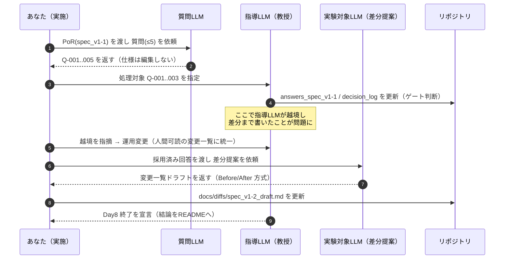

# 研究メモ（2025-09-20）— Day8 総括

## 目的（1行）
2つのLLM（質問生成／指導）を使い、PoR（spec_v1-1.md）を壊さずに差分提案まで進める運用を検証する。

## 前提・役割
- **PoR**：`docs/spec_v1-1.md`（凍結。本文は直編集しない）
- **質問LLM**（Reviewer想定）：PoRを読み、質問のみ返す（≤5件／回）
- **指導LLM（教授）**：計画・進行・ゲート判断のみ。**仕様本文や差分の生成はしない**
- **実験対象LLM**：採用済み回答をもとに**差分提案**を出す（人が読むドラフトに統一）

---

## 結果（結論）
- **越境が発生**：指導LLMが仕様・差分まで書き、文体の不自然さ／不要な構造化／意図のズレが発生。
- **運用変更**：機械可読な「変更指示書」を**廃止**。**人間可読の変更一覧**（Before/After／「見出しの末尾に追加」）に統一。
- **採用した決定（Q-001〜003）**  
  1) 同時保有上限=1冊。貸出リクエストは1件=1冊。  
  2) 保有1冊の間は新規貸出を拒否（HTTP 409 `BORROW_LIMIT_EXCEEDED`）。  
  3) 期限超過（14日超過）は `OVERDUE`。`OVERDUE` 中は新規貸出不可、返却のみ可。自動返却／延滞金は本版の仕様外。  
- **Day8で終了**：結論と教訓をREADMEに反映済み。次回は役割固定で再開。

---

## 変更一覧（人間可読のドラフト）
PoR：`docs/spec_v1-1.md` 前提。**本文はまだ変更しない**（次版マージ用）。

### 変更1（Q-20250919-001）
**Before**
```
1. ユーザーは本を1冊借りられる。
```
**After**
```
1. ユーザーの同時保有上限は1冊とする。
   貸出リクエストは1件につき対象冊数=1冊。
```

### 変更2（Q-20250919-002）
**追加（「## 基本要求」の末尾）**
```
- バリデーション: currentLoansCount(userId) >= 1 の場合は貸出拒否（HTTP 409, BORROW_LIMIT_EXCEEDED）。
```

### 変更3（Q-20250919-003）
**追加（「## 制約」の末尾）**
```
- 14日超過時は status=OVERDUE。OVERDUE中は新規貸出不可、返却は常に可。
- 自動返却／延滞金／自動停止は本版の仕様外。
```

---

## 流れ（時系列の図）


## 役割×成果物（構造の図）
```mermaid
flowchart LR
  subgraph PO[PoR（凍結）]
    S[docs/spec_v1-1.md]
  end

  subgraph QROLE[質問LLM]
    QJ[質問を返す（≤5）]
  end

  subgraph PROLE[指導LLM]
    ANS[answers_spec_v1-1.md]
    DEC[decision_log.md]
    GATE[ゲート判断]
  end

  subgraph EROLE[実験対象LLM]
    DRAFT[変更一覧ドラフト<br/>(人間可読)]
  end

  U[(あなた)]
  U -->|PoRを渡す| QJ
  QJ -->|Q-###| U
  U -->|対象Q指定| PROLE
  S --> ANS
  ANS --> DEC
  PROLE -->|採用/保留/却下| EROLE
  EROLE -->|変更一覧| U
  U -->|反映| DRAFT
  S -.マージ時のみ.-> DRAFT
  class S freeze
  classDef freeze fill:#eee,stroke:#888,stroke-dasharray: 3 3;
```

---

## ルール（次回プロンプトに埋め込む）
- 文は短く言い切り。用語は **貸出／返却／保有／上限／期限超過** に固定。曖昧語禁止。
- 指導LLMは**計画・進行・ゲートのみ**。**仕様本文／差分生成は禁止**。
- 実験対象LLMは、採用済み回答だけを根拠に**「変更一覧ドラフト」**を返す。  
  形式：**Before/After** または **「見出しの末尾に追加」**。**新機能は出さない**。
- 1反復＝「Q ≤3件 → 回答 → ゲート → 変更一覧作成 → draft更新」。本文マージは次版で行う。

---

## 再現手順（ショート）
1. PoRを確定：`docs/spec_v1-1.md` を凍結。
2. 質問LLMに質問生成を依頼（≤5）。
3. 指導LLMが対象Qを選定し、`answers_spec_v1-1.md`／`decision_log.md` を更新（ゲート判断）。
4. 実験対象LLMに**変更一覧ドラフト**を作らせる（人間可読）。
5. `docs/diffs/spec_v1-2_draft.md` に追記。
6. 版上げ時に `spec_v1-2.md` を作成してマージ。

---

## 失敗からの学び
- 役割が曖昧だと、**越境 → 文体劣化 → 意図のズレ**が起きる。
- 「機械可読な指示書」は本件では**過剰**。シンプルな**人間可読の変更一覧**が早くて安全。
- アンカーを使う自動化は、**最終段**（マージ時）に限定する方が合う。

---

## 次にやること（Day9の入口）
- Q-004（返却権限）／Q-005（履歴範囲）を、上のルールで回す。
- draftが揃い次第、`spec_v1-2.md` を生成して本文へ反映。

（以上）
